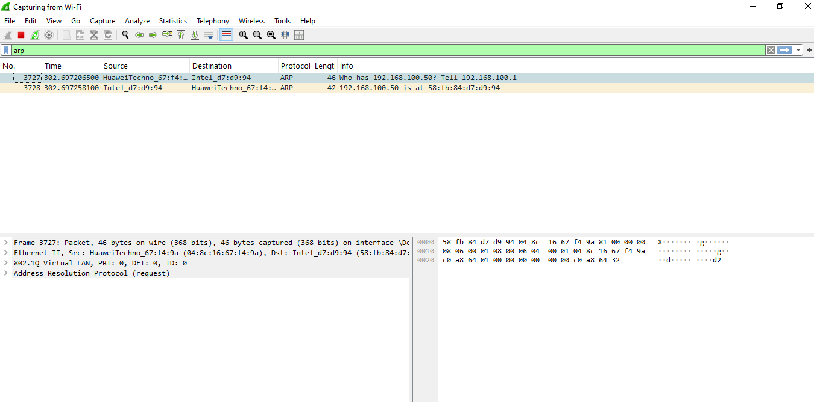
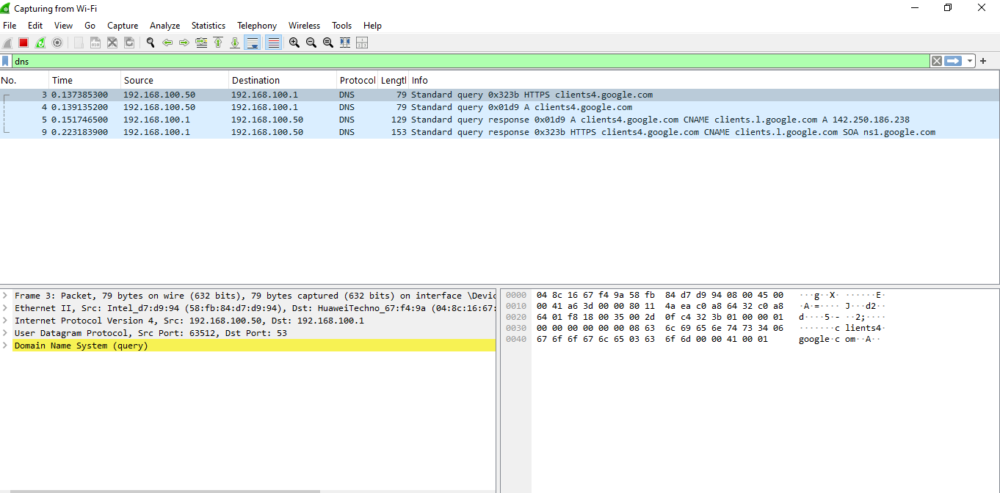
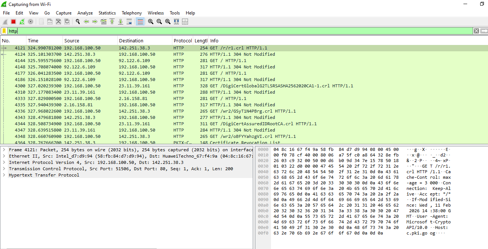
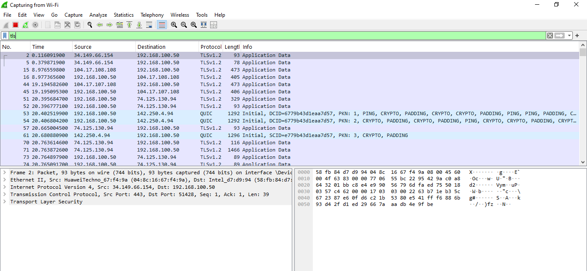
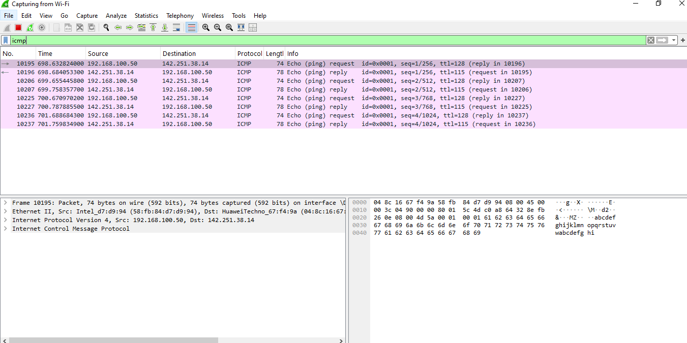

  

# Week 1 — Day 1: Networking Fundamentals for SOC

Part of the [Cyberster Blue Team Internship](../../README.md) — Week 1, Day 1.

## Objective

Build a working understanding of how networks behave before touching any VM or SIEM tool, since most SOC alerts only make sense if the underlying protocol behavior is understood first. This day covered the OSI/TCP-IP model, subnetting, core SOC ports, and 5 protocols (ARP, DNS, HTTP, HTTPS, ICMP) using live traffic captured with Wireshark.

## Build Process

### Phase 1 — Core Networking Theory
- Traced a full web request through the OSI and TCP/IP models, from browser request down to the physical layer and back through the server's response
- Reviewed subnetting and CIDR notation — confirming when two IPs on a `/24` can talk directly without a router
- Reviewed 8 SOC-relevant ports: 22 (SSH), 25 (SMTP), 53 (DNS), 80 (HTTP), 443 (HTTPS), 445 (SMB), 3389 (RDP), 8080 (alt-HTTP)

### Phase 2 — Planned Lab Topology
- Mapped out the intended VirtualBox lab: three VMs (Kali Linux, Ubuntu Server, Windows 10), each with a NAT adapter (internet access) and a Host-Only adapter (internal communication on `192.168.56.x`)

| Evidence |
|---|
|  | 

### Phase 3 — Live Traffic Capture
- Captured ~10 minutes of live traffic on the host machine using Wireshark
- Filtered the capture by 5 protocols and documented what normal traffic looks like for each, with a note on what suspicious traffic would look like instead
- Full raw capture file: [`Day1_Final_Capture.pcapng`](./Day1_Final_Capture.pcapng)

## Protocol Evidence

### ARP
Router resolved a known IP (`192.168.100.50`) to its MAC address — standard request/reply. Suspicious pattern to watch for: one MAC address claiming multiple different IPs (spoofing / MITM).

### DNS
Standard queries for `clients4.google.com`, resolved via CNAME to a Google IP. Suspicious pattern to watch for: long, randomized domains (possible C2 traffic) or DNS to an unauthorized server.

### HTTP
Plain-text GET requests fetching Certificate Revocation Lists (`.crl`) — routine background checks. Suspicious pattern to watch for: login credentials or sensitive data sent unencrypted.

### HTTPS / TLS
Multiple TLSv1.2 "Application Data" packets — normal encrypted browsing. Suspicious pattern to watch for: self-signed/expired certs, or large encrypted uploads to unknown destinations.

### ICMP
4 echo request/reply pairs to a Google IP, generated manually via `ping`. Suspicious pattern to watch for: large floods of ICMP traffic (scanning or DoS attempts).

## What I Learned for SOC

While reviewing my own ARP capture, I caught that my first explanation had it backwards. I initially described the router as "looking for my laptop's IP address" — but the IP was already known. ARP's actual job is resolving a known IP **into** a MAC address, not the other way around. Re-checking my explanation against the real packet (`Who has 192.168.100.50? Tell 192.168.100.1`) is what caught this.

I also learned that not every protocol shows up from passive browsing — ICMP never appeared in my capture until I manually ran `ping` to generate it myself.
